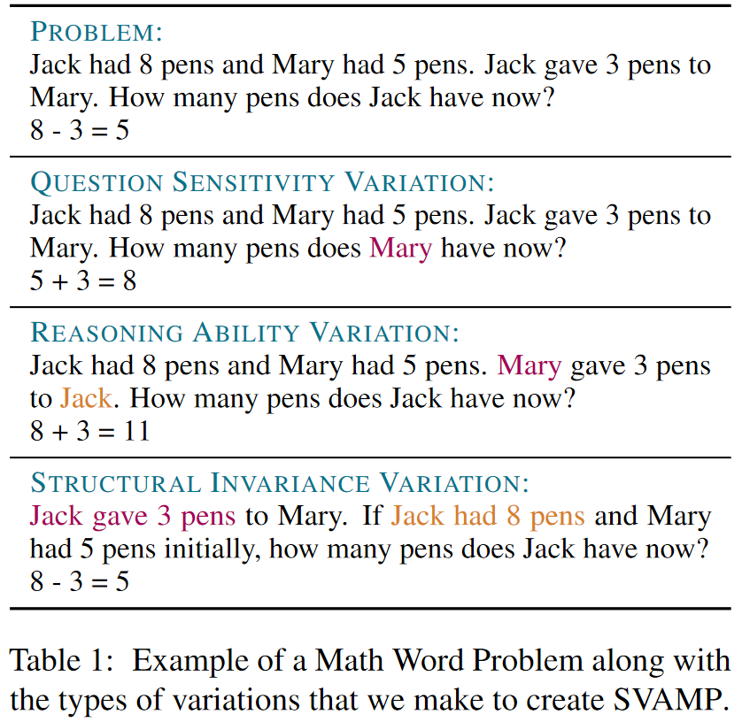

<h2 align="center">
  SVAMP
</h2>
<h5 align="center"> Are NLP Models really able to Solve Simple Math Word Problems?</h5>

<p align="center">
  <a href="https://2021.naacl.org/"></a>
  <a href="https://arxiv.org/abs/2103.07191"></a>
  <a href="https://github.com/arkilpatel/SVAMP/blob/main/LICENSE">
    
  </a>
</p>

The task of solving Math Word Problems (MWPs) has received significant research attention in the past years. An MWP consists of a short Natural Language narrative that describes a state of the world and poses a question about some unknown quantities (see Table 1 for examples).

<h2 align="center">
  
</h2>
<p style="text-align: justify;">
In this work, we show deficiencies in two benchmark datasets - <a href="https://github.com/chaochun/nlu-asdiv-dataset">ASDiv-A</a> and <a href="https://github.com/sroy9/mawps">MAWPS</a>. We first show that existing models achieve reasonably high accuracies on these datasets even after removing the "question" part of the MWP at test time. We further show that a simple model without any word-order information can also solve a majority of MWPs in these datasets. Our experiments indicate that existing models rely on shallow heuristics in benchmark MWP datasets for achieving high performance.
</p>

<p style="text-align: justify;">
Our experiments render the benchmark datasets unreliable to measure model performance. To enable more robust evaluation of automatic MWP solvers, we created a challenge set called "SVAMP". The examples in SVAMP test a model across different aspects of solving MWPs. Table 1 provides three examples from SVAMP that test whether a model is Question-sensitive, has robust reasoning ability or is invariant to structural alterations respectively.
</p>


#### Dependencies

- compatible with python 3.6
- dependencies can be installed using `SVAMP/code/requirements.txt`

#### Setup

Install VirtualEnv using the following (optional):

```shell
$ [sudo] pip install virtualenv
```

Create and activate your virtual environment (optional):

```shell
$ virtualenv -p python3 venv
$ source venv/bin/activate
```

Install all the required packages:

at `SVAMP/code:`

```shell
$ pip install -r requirements.txt
```

To create the relevant directories, run the following command in the corresponding directory of that model:

for eg, at `SVAMP/code/graph2tree:`

```shell
$ sh setup.sh
```

Then transfer all the data folders to the data subdirectory of that model. For example, copy the MAWPS data directory i.e. `cv_mawps` from `SVAMP/data` to `SVAMP/code/graph2tree/data/`.

#### Models

The current repository includes 5 implementations of Models:

- RNN Seq2Seq at `SVAMP/code/rnn_seq2seq`
  - Basic Encoder-Decoder with Attention Network. Choice of RNN unit provided among LSTM, GRU or RNN.
- Transformer Seq2Seq at `SVAMP/code/transformer_seq2seq`
  - Basic Transformer Network.
- GTS at `SVAMP/code/gts`
  - RNN Encoder with Tree-based Decoder ([Original Implementation](https://github.com/ShichaoSun/math_seq2tree)).
- Graph2Tree at `SVAMP/code/graph2tree`
  - Graph-based Encoder with Tree-based Decoder ([Original Implementation](https://github.com/2003pro/Graph2Tree)).
- Constrained Model at `SVAMP/code/constrained`
  - Constrained model as described in the paper. Feed-Forward Network maps input embeddings to hidden representations and LSTM Decoder with attention generates the equation.

#### Datasets

We work with the following datasets:

- `mawps`
  - [Paper](https://www.aclweb.org/anthology/N16-1136.pdf) and [Github](https://github.com/sroy9/mawps).
  - `Data Size:` 1921
  - Evaluated by Cross-Validation over 5 splits.
  
- `asdiv-a`
  - [Paper](https://www.aclweb.org/anthology/2020.acl-main.92.pdf) and [Github](https://github.com/chaochun/nlu-asdiv-dataset).
  - `Data Size:` 1217
  - Evaluated by Cross-Validation over 5 splits.
  
- `svamp`
  - `SVAMP/SVAMP.json`  
  - `Data Size:` 1000
  - Complete challenge set to be used for evaluation.

A description of the individual data files in the `SVAMP/data` directory is given below:

- `SVAMP/data/cv_asdiv-a`
  - 5-fold Cross Validation splits of ASDiv-A dataset.

- `SVAMP/data/cv_asdiv-a_without_questions`
  - 5-fold Cross Validation splits of ASDiv-A dataset with questions removed in the test sets.

- `SVAMP/data/cv_mawps`
  - 5-fold Cross Validation splits of MAWPS dataset.

- `SVAMP/data/cv_mawps_without_questions`
  - 5-fold Cross Validation splits of MAWPS dataset with questions removed in the test sets.

- `SVAMP/data/mawps-asdiv-a_svamp`
  - Train set: Combination of full MAWPS and ASDiv-A. Size: 2373 + 1218.
  - Test set: SVAMP. Size: 1000.

- `SVAMP/data/mawps-asdiv-a_svamp_without_questions`
  - Train set: Combination of full MAWPS and ASDiv-A. Size: 2373 + 1218
  - Test set: SVAMP with questions removed from the MWPs. Size: 1000.

- `SVAMP/data/cv_svamp_augmented`
  - 5-fold Cross Validation splits of combined MAWPS, ASDiv-A and SVAMP. In each fold, the test set consists of problems from only SVAMP while the train set consists of problems from the rest of SVAMP and complete MAWPS and ASDiv-A.

#### Usage

The set of command line arguments available can be seen in the respective `args.py` file. Here, we illustrate running the experiment for cross validation of the ASDiv-A dataset using the Seq2Seq model. Follow the same methodology for running any experiment over any model.

##### Running Seq2Seq Model for Cross Validation of ASDiv-A

If the folders for the 5 folds are kept as subdirectories inside the directory `../data/cv_asdiv-a:` (for eg, fold0 directory will have `../data/cv_asdiv-a/fold0/train.csv` and `../data/cv_asdiv-a/fold0/dev.csv`),

then, at `SVAMP/code/rnn_seq2seq:`

```shell
$	python -m src.main -mode train -gpu 0 -embedding roberta -emb_name roberta-base -emb1_size 768 -hidden_size 256 -depth 2 -lr 0.0002 -emb_lr 8e-6 -batch_size 4 -epochs 50 -dataset cv_asdiv-a -full_cv -run_name run_cv_asdiv-a
```

#### Citation

If you use our data or code, please cite our work:

```
@inproceedings{patel-etal-2021-nlp,
    title = "Are {NLP} Models really able to Solve Simple Math Word Problems?",
    author = "Patel, Arkil  and
      Bhattamishra, Satwik  and
      Goyal, Navin",
    booktitle = "Proceedings of the 2021 Conference of the North American Chapter of the Association for Computational Linguistics: Human Language Technologies",
    month = jun,
    year = "2021",
    address = "Online",
    publisher = "Association for Computational Linguistics",
    url = "https://aclanthology.org/2021.naacl-main.168",
    doi = "10.18653/v1/2021.naacl-main.168",
    pages = "2080--2094",
    abstract = "The problem of designing NLP solvers for math word problems (MWP) has seen sustained research activity and steady gains in the test accuracy. Since existing solvers achieve high performance on the benchmark datasets for elementary level MWPs containing one-unknown arithmetic word problems, such problems are often considered {``}solved{''} with the bulk of research attention moving to more complex MWPs. In this paper, we restrict our attention to English MWPs taught in grades four and lower. We provide strong evidence that the existing MWP solvers rely on shallow heuristics to achieve high performance on the benchmark datasets. To this end, we show that MWP solvers that do not have access to the question asked in the MWP can still solve a large fraction of MWPs. Similarly, models that treat MWPs as bag-of-words can also achieve surprisingly high accuracy. Further, we introduce a challenge dataset, SVAMP, created by applying carefully chosen variations over examples sampled from existing datasets. The best accuracy achieved by state-of-the-art models is substantially lower on SVAMP, thus showing that much remains to be done even for the simplest of the MWPs.",
}
```

For any clarification, comments, or suggestions please contact [Arkil](http://arkilpatel.github.io/) or [Satwik](https://satwikb.com/).
